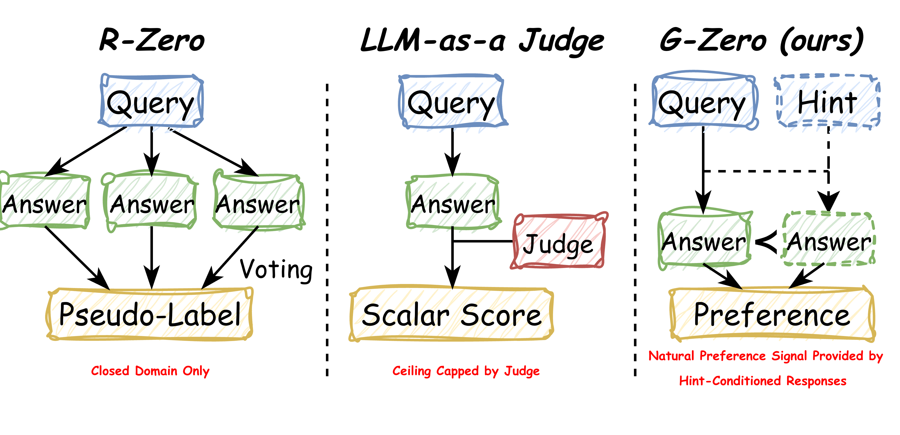
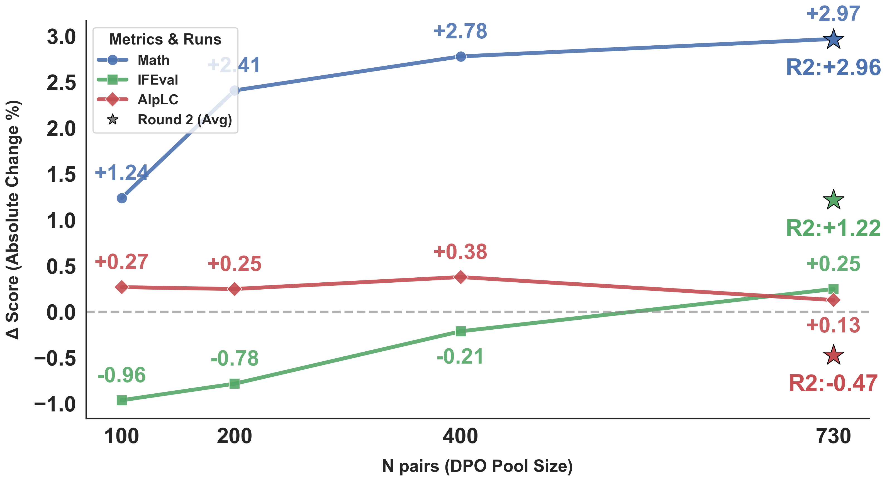
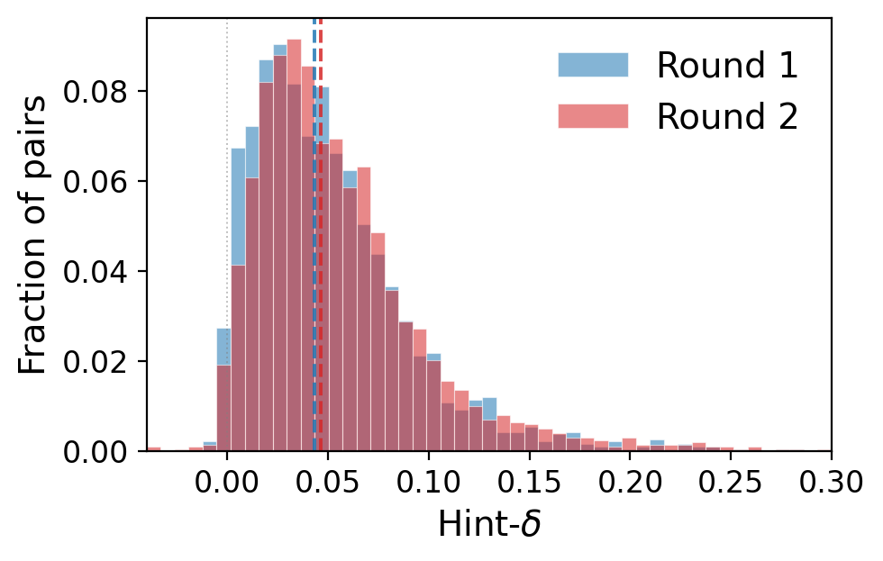

# G-Zero: Self-Play for Open-Ended Generation from Zero Data

<p align="center">
  <a href="https://arxiv.org/abs/2605.09959">
    </a>
  <a href="LICENSE">
    </a>
</p>

> Self-play preference optimization for open-ended generation, with **no
> ground-truth answers, no LLM judge in training, and no majority vote**.
> The training signal is the **hint-induced log-prob shift δ** — purely
> intrinsic, computed from the Solver itself.

<p align="center">
  
</p>

The Challenger writes a request `q` and a short hint `h`. The Solver
produces an un-assisted response `a_hard ~ π(·|q)`. We measure how much
the hint shifts the Solver's distribution away from `a_hard`:

```
δ(q, h, a_hard) = mean_t log π(a_hard_t | q, a_hard_<t)
                − mean_t log π(a_hard_t | q, h, a_hard_<t)
```

The Solver is then DPO-trained on `chosen = a_assisted` vs.
`rejected = a_hard`, conditioned on **only `q`** — internalizing the
hint-induced style improvement so that hints are no longer needed at
test time.

---

## Why δ instead of a reward model or judge

Most "self-play" pipelines in the open-ended regime depend on either a
ground-truth verifier (RLVR), a frozen LLM judge (RLAIF, Self-Rewarding,
DICE), or majority-vote pseudo-labels (R-Zero, SPIN). All three break in
the open-ended setting: no verifier exists, judges are slow / biased /
position-sensitive, and majority vote presupposes a single right answer.

δ is **intrinsic to the Solver itself**:

- High δ ⇒ the hint reveals an answer the Solver wouldn't have produced
  un-aided ("answer leakage"). DPO over high-δ pairs teaches the Solver
  to copy from hints — hurts no-hint generalization.
- Low δ (≈0) ⇒ the hint provides structural framing without revealing
  the answer. DPO over low-δ pairs distills a **style shift** — what
  actually transfers.

Empirically, δ is positive in ~99% of valid (q, h) pairs. We retain the
**lower half** of the empirical δ distribution (the `bot50` filter) —
`(q, h)` pairs whose hint nudges structure without leaking the answer.

---

## Method

<p align="center">
  
</p>

A single training round consists of three interacting phases. The
Challenger generates `(q, h)` pairs; the Solver produces an un-assisted
response `a_hard ~ π(·|q)`; we compute the hint-induced log-prob shift
δ; and the Solver is DPO-trained on a δ-filtered subset of the pool.

### Phase 1 — Challenger (GRPO, optional)

The Challenger is GRPO-trained against:

```
r(q, h) = δ(q, h, a_hard)
        − λ_len · max(0, |h| − L_tgt) / 100         # length hinge (λ=0.03, L=200)
        − BLEU_cluster_share(q, batch)              # diversity penalty
```

We use Dr.GRPO mean-only advantages. Without the length hinge, the
Challenger reward-hacks via verbose hints; without the BLEU cluster
penalty it collapses to a single high-δ template. The
`--run_phase1 false` ablation (drops Phase 1 entirely; uses the base
model directly as the Challenger) matches Phase-1-on R1 within noise on
Qwen3-8B-Base.

### Phase 2 — Build the DPO pool

For each Challenger-generated `(q, h)`:

1. Sample `a_hard ~ π(·|q)` and `a_assisted ~ π(·|q, h)`.
2. Compute `δ` via `compute_logprobs` of `a_hard` under both contexts.
3. Cache the full scored pool (`raw_pool.jsonl`) so re-filtering is free.
4. Apply δ-percentile filter `[pct_low, pct_high]` (paper-main = bot50)
   plus structural quality filters (length, repetition via zlib ratio,
   prompt echo, role-marker prefix).

### Phase 3 — DPO the Solver

Standard DPO-sigmoid (Rafailov 2023) with two specifics:

1. **Length-normalized log-ratios**: `dot(logp, mask) / mask_sum` so a
   longer `chosen` doesn't dominate the gradient.
2. **DPO prompt is `q` only, no hint**. We distill the hint-assisted
   behavior into the Solver's q-only conditional, so the trained Solver
   no longer needs hints at test time.

`π_ref` is the Solver's weights at the start of Phase 3 (frozen
snapshot via `save_weights_and_get_sampling_client`).

---

## Setup

```bash
git clone <this-repo> && cd release/
python -m venv .venv && source .venv/bin/activate
pip install -r requirements.txt
export TINKER_API_KEY=<your-key>          # https://tinker.thinkingmachines.ai/
```

If `instruction_following_eval` is not on PyPI for your environment:

```bash
pip install git+https://github.com/google-research/google-research.git#subdirectory=instruction_following_eval
```

No local GPU needed — all training and sampling runs on
[Tinker](https://thinkingmachines.ai/tinker).

---

## Reproducing the paper

| Experiment                         | Script                                          | Approx. cost   |
|------------------------------------|-------------------------------------------------|----------------|
| Main — Qwen3-8B-Base, R1           | `bash scripts/main_qwen3_8b_base.sh`            | ~$5–8, 5–7 h   |
| Main — Llama-3.1-8B-Instruct       | `bash scripts/main_llama3_8b_instruct.sh`       | ~$5–8, 5–7 h   |
| Ablation — no Phase 1              | `bash scripts/ablation_no_phase1.sh`            | ~$3–5, 3–5 h   |
| Ablation — δ-cutoff sweep          | `bash scripts/ablation_cutoffs.sh`              | ~$8–12, 6–10 h |
| Ablation — pool-size scaling       | `bash scripts/ablation_scaling.sh`              | ~$10–15, 8–14h |
| Ablation — multi-round (R1 → R3)   | `bash scripts/ablation_multi_round.sh`          | ~$15–25, 15–20h|
| Eval-only on existing checkpoint   | `bash scripts/eval_only.sh <sampler_uri>`       | ~$1, 1–1.5 h   |

All scripts forward extra flags to `g_zero/main.py` — e.g. add
`--eval_tasks aime24,aime25` to skip the slow Alpaca step during
ablations.

### One-command default

```bash
bash run.sh                           # = scripts/main_qwen3_8b_base.sh
bash run.sh --run_phase1 false        # no_phase1 ablation
bash run.sh --tag big --num_questions 5000
```

Override **any** Config field as `--field value`; see
[`g_zero/config.py`](g_zero/config.py) for the full list.

### Outputs

```
runs/<tag>/
├── challenger/
│   ├── checkpoints.jsonl         # Tinker URIs of trained Challenger
│   ├── metrics.jsonl             # reward / δ / valid_frac / hint length per step
│   └── logs.log
├── raw_pool.jsonl                # Phase 2 full scored pool (q, h, a_hard, a_assisted, δ)
├── dpo_data.jsonl                # Phase 2 filtered (prompt, chosen, rejected, δ)
├── solver/
│   ├── checkpoints.jsonl         # Tinker URIs of trained Solver
│   ├── metrics.jsonl             # DPO loss / accuracy / margin per step
│   └── logs.log
└── eval/
    ├── results_aime24.jsonl
    ├── results_aime25.jsonl
    ├── results_ifeval.json
    ├── alpaca_eval/summary.json
    └── summary.json              # all metrics flattened
```

---

## Key results

### δ-cutoff ablation — bot50 is the most balanced configuration

The δ-percentile sweep is reported as a table in the paper.
`[0, 50]` (bot50) is the most balanced profile we tested: small drops
on Math vs. the no-filter `[0, 100]` setting are offset by gains on
IFEval / AlpacaEval, while the upper-half `[50, 100]` filter trades
verifiable instruction following for chat-style helpfulness — a
signature of the "answer leakage" failure mode. The surrounding band
`[0, 50] ± 30 pp` produces broadly comparable averages, so we adopt
`[0, 50]` as the default but it is not strictly dominant. Reproduce
this with `scripts/ablation_cutoffs.sh`.

### Capability scaling dynamics

<p align="center">
  
</p>

> Δ relative to the base model across incremental DPO pool sizes
> `N ∈ {100, 200, 400, 730}` and the from-scratch Round 2 (star at
> N = 730). The three capability axes show **distinct, axis-specific
> saturation curves**, not a uniform trade-off:
> Math gains are rapid and saturate early (`+1.24` at N = 100 already
> covers >40% of the final `+2.97`); IFEval starts negative at small N
> and only the global Round-2 from-scratch optimization fully unlocks
> the capability (`+1.22`); AlpacaEval LC stays roughly flat under
> incremental DPO. Reproduce with `scripts/ablation_scaling.sh`.

### Co-evolutionary δ shift across rounds

<p align="center">
  
</p>

> Empirical Hint-δ distributions for Round 1 and Round 2; dashed lines
> mark per-round medians. The rightward shift evidences a
> **co-evolutionary arms race**: as the Solver becomes a stronger
> reasoner, it stops being perturbed by trivial hints — so the
> Challenger adapts by synthesizing increasingly impactful hints. This
> raises the difficulty ceiling and prevents stagnation. Reproduce
> with `scripts/ablation_multi_round.sh`.

---

## Codebase layout

```
release/
├── README.md                  ← this file
├── LICENSE                    ← MIT
├── requirements.txt
├── run.sh                     ← one-command driver (= main_qwen3_8b_base)
├── assets/                    ← README figures
├── scripts/                   ← canned experiments
│   ├── main_qwen3_8b_base.sh
│   ├── main_llama3_8b_instruct.sh
│   ├── ablation_no_phase1.sh
│   ├── ablation_cutoffs.sh
│   ├── ablation_scaling.sh
│   ├── ablation_multi_round.sh
│   └── eval_only.sh
└── g_zero/
    ├── config.py              ← every hyperparameter, single source of truth
    ├── prompts.py             ← Challenger / Solver prompts
    ├── parse.py               ← <question>/<hint> XML extractor
    ├── bleu_penalty.py        ← BLEU-cluster duplication penalty (Phase 1)
    ├── hint_delta.py          ← δ via Tinker compute_logprobs
    ├── phase1.py              ← Challenger GRPO
    ├── phase2.py              ← (q, h) generation + δ-scoring + filtering
    ├── phase3.py              ← Solver DPO
    ├── multi_round.py         ← outer loop over rounds (resumable)
    ├── eval.py                ← eval dispatcher
    ├── eval_aime.py           ← AIME 2024 / 2025 mean@32
    ├── eval_ifeval.py         ← IFEval (rule-based)
    ├── eval_alpaca.py         ← AlpacaEval LC win rate, Tinker-hosted judge
    └── main.py                ← phases 1+2+3+eval, single round
```

Each phase is a stand-alone module: nothing in `phase2.py` imports from
`phase3.py`, the eval scripts can be called on a base sampler with no
training. This makes it easy to swap in a different Solver update rule
(e.g. on-policy distillation in place of DPO) — see the docstrings.

---

## Caching & resumability

- **Phase 2 pool**: `raw_pool.jsonl` is cached. Changing `pct_low /
  pct_high / chosen_*` filters and re-running only re-runs the filter
  step.
- **DPO data**: `dpo_data.jsonl` is similarly cached.
- **Solver / Challenger checkpoints**: persisted as Tinker URIs in
  `checkpoints.jsonl`; `eval_only.sh` can re-run eval on any of them.
- **Multi-round**: per-round resume state in `runs/<tag>/resume_state.json`
  — re-running the same command picks up at the next round.

---

## Configuration knobs that matter

The defaults in [`g_zero/config.py`](g_zero/config.py) reproduce the
paper-main numbers. Knobs that are *load-bearing*:

| Field                            | Default | Why it matters |
|----------------------------------|---------|----------------|
| `pct_low`, `pct_high`            | 0, 50   | bot50 cutoff. Upper tail = answer leakage. |
| `hint_length_target_chars`       | 200     | Length-hinge target — without it, Challenger reward-hacks. |
| `hint_length_penalty_lambda`     | 0.03    | Hinge weight. Larger → shorter hints → less signal. |
| `dpo_beta`                       | 2.0     | DPO temperature; lower-than-typical because the chosen / rejected gap is small in the open-ended regime. |
| `dpo_lr`                         | 1e-5    | DPO has a narrow, model-dependent sweet spot. Always check Alpaca after DPO. |
| `solver_max_tokens`              | 8192    | Truncating responses below this loses real signal — bot50 ≠ short responses. |
| `aime_temperature`               | 0.7     | mean@32 needs > 0 to actually sample different paths. |
| `alpaca_judge_model`             | Qwen/Qwen3-235B-A22B-Instruct-2507 | Llama-3.1-70B has severe position bias on this template. |

---

## Citation

```bibtex
@misc{huang2026gzeroselfplayopenendedgeneration,
      title={G-Zero: Self-Play for Open-Ended Generation from Zero Data},
      author={Chengsong Huang and Haolin Liu and Tong Zheng and Runpeng Dai and Langlin Huang and Jinyuan Li and Zongxia Li and Zhepei Wei and Yu Meng and Jiaxin Huang},
      year={2026},
      eprint={2605.09959},
      archivePrefix={arXiv},
      primaryClass={cs.LG},
      url={https://arxiv.org/abs/2605.09959},
}
```

---

## Acknowledgments

This release runs end-to-end on
[Tinker](https://thinkingmachines.ai/tinker) and uses the open-source
[`tinker-cookbook`](https://github.com/thinking-machines-lab/tinker-cookbook)
for renderers, checkpoint utils, and ML logging. AlpacaEval prompts and
GPT-4-Turbo reference outputs come from
[`tatsu-lab/alpaca_eval`](https://huggingface.co/datasets/tatsu-lab/alpaca_eval);
IFEval verifiers from
[google-research/instruction_following_eval](https://github.com/google-research/google-research/tree/master/instruction_following_eval);
AIME problems from `Maxwell-Jia/AIME_2024` and `yentinglin/aime_2025`.

We gratefully acknowledge the Thinking Machines Lab Tinker Research Grant for supporting the experimental efforts of this work. This research was also supported in part by the NVIDIA Academic Grant Program and WashU Ignite Interdisciplinary Grants.
